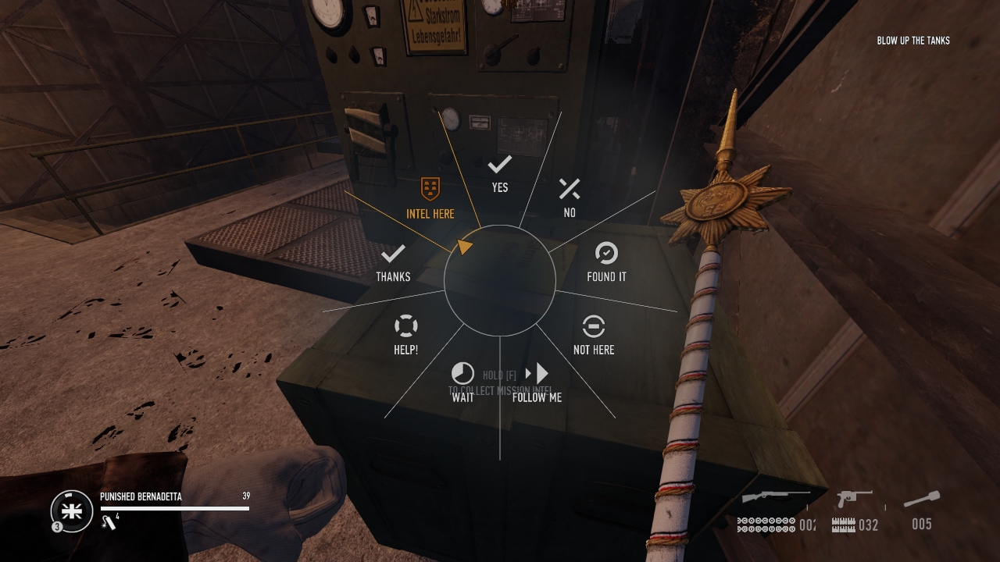

# Expanded Communications Wheel

RAID: World War II mod adding more options to in-game communications wheel.

* Replaces "Enemies" with "Thanks"
* Adds "Contextual" option, that can be used to point out
  * Outlaw raid intel
  * Large healthkits
  * Crowbars
  * Locked crates ("Need a crowbar here")

Works even if only you have the mod.

Please suggest other things you want to see added.

